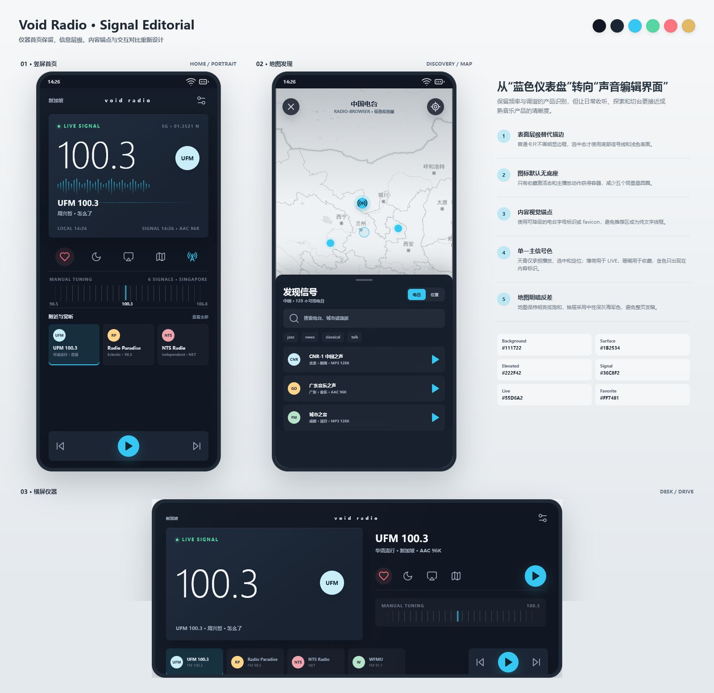

# Signal Editorial 视觉方案

## 目标

吸收 Moodi.fm 在信息层级、内容视觉锚点、播放状态和发现效率上的优点，同时保留 Void Radio 的频率主卡、手动调谐、地图探索和横屏仪器识别。

## 设计原则

- 不直接复制 Moodi.fm 的代码、图标、素材和页面结构。
- 不把整页涂成同一蓝色家族；主背景保持中性深灰海军色。
- 普通控件依靠 Surface 明度区分，不依靠高亮描边。
- 非激活功能图标取消圆形底座，激活态和主播放动作才获得容器。
- 推荐频道使用 favicon 或可降级字母标识，避免纯文字卡片。
- 天青用于播放、定位和选中；薄荷用于直播；珊瑚用于收藏；金色只作为内容标识。
- 地图使用明亮低饱和底图，抽屉使用深色 Surface，保持清楚反差。

## 原型范围

- 竖屏首页。
- 地图发现与电台抽屉。
- 横屏仪器模式。

## 视觉证据

- 竖屏首页：[signal_editorial_home.png](signal_editorial_home.png)
- 地图发现：[signal_editorial_map.png](signal_editorial_map.png)
- 横屏仪器：[signal_editorial_landscape.png](signal_editorial_landscape.png)

## 非目标

- 本轮不修改 Flutter 代码。
- 不替换 V1.1.3 暖金默认主题。
- 不合并 `codex/v2-signal-blue-theme` Draft PR #7。
- 不调整音频、地图、私人微电台和数据逻辑。

## 验收重点

- 首页不再呈现“蓝色 CAD 面板”观感。
- 快捷图标、选中状态和播放主动作层级明确。
- 推荐频道即使没有官方 Logo 也有稳定视觉锚点。
- 竖屏、地图和横屏保持同一套视觉语法。
- 用户确认设计图后，才创建 Flutter UI 实现分支。

## 预览检查

- 2026-07-15 使用本地浏览器完成竖屏 `500 x 930`、地图 `500 x 930`和横屏 `1000 x 434` 画板检查。
- 29 个 Lucide 图标全部渲染，未发现缺失图标。
- 首页底部播放区完整，推荐频道与调谐区无溢出。
- 地图素材已改为原型目录内的相对路径，并避免了旧界面按钮与新原型叠加。
- 横屏操作栏、调谐区和频道列表完整可见。
- **待人工确认**：视觉方向通过后，再将语义 Token 和组件层级落到 Flutter。
